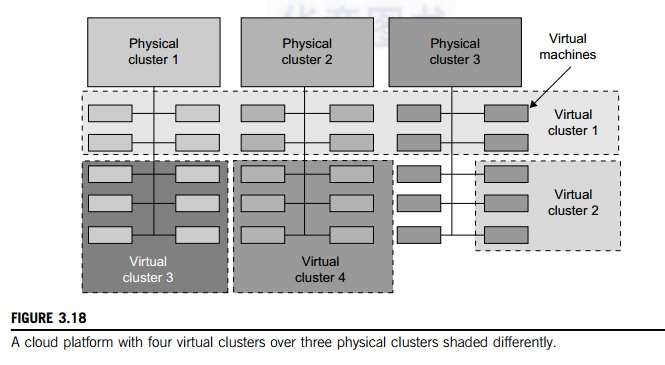

### ML common
* Softmax 
* Relu `f(x)=max(0, x)`
* Pool
* Conv

### Tensorflow
TensorFlow is composed of two parts, a library for defining computational graphs and a runtime for executing these graphs, that’s the **Graph** and **Session**

[Understand TensorFlow graph](https://medium.com/@d3lm/understand-tensorflow-by-mimicking-its-api-from-scratch-faa55787170d)
* Variables: Think of TensorFlow variables like normal variables in our computer programs. A variable can be modified at any point in time, but the difference is that they have to be initialized before running the graph in a session. They represent changeable parameters within the graph. A good example for variables would be the weights or biases in a neural network.
* Placeholders: A placeholder allows us to feed data into the graph from outside and unlike variables they don’t need to be initialized. Placeholders simply define the shape and the data type. We can think of placeholders as empty nodes in the graph where the value is provided later on. They are typically used for feeding in inputs and labels.
* Constants: Parameters that cannot be changed. **Variables** are being optimized during the backward pass while **constants** and **placeholders** are not.
* Operations: Operations represent nodes in the graph that perform computations on Tensors.
* Graph: A graph is like a central hub that connects all the variables, placeholders, constants to operations.
* Session: A session creates a runtime in which operations are executed and Tensors are evaluated. It also allocates memory and holds the values of intermediate results and variables.

#### sample tf graph
* graph defination

```python
import tensorflow as tf

with tf.Session() as sess:
    # build graph to session default graph
    a = tf.constant(15, name="a")
    b = tf.constant(25, name="b")
    mul = tf.multiply(a, b, name="multiply")
    summation = tf.add(a, b, name="add")
    out = tf.divide(mul, summation, name="divide")

    # execute graph through sess
    o = sess.run(out)
    print(o)

    # save logs for tensorboard
    fw = tf.summary.FileWriter('./logs', sess.graph)
```


* start [tensorboard](https://github.com/tensorflow/tensorboard)
  1. tensorboard --logdir ./logs
  2. navigate to localhost:6006

#### tf2onnx
* convert tf operations to onnx nodes
* apply rewrite(if necessary)
* top sort onnx nodes


### Distributed traning

[Why batch size and what is mini-bach](https://towardsdatascience.com/how-to-break-gpu-memory-boundaries-even-with-large-batch-sizes-7a9c27a400ce)

[What is gradient accumulation?](https://towardsdatascience.com/what-is-gradient-accumulation-in-deep-learning-ec034122cfa)

[Batch vs Epoch vs Iteration](https://machinelearningmastery.com/difference-between-a-batch-and-an-epoch/)

[Batch vs Epoch vs Iteration 2](https://towardsdatascience.com/epoch-vs-iterations-vs-batch-size-4dfb9c7ce9c9)
* Epoch: one Epoch is when an ENTIRE dataset is passed forward and backward through the neural network only ONCE.
* Batch: is the number the dataset divided to.
* Batch size: is the size of each Batch.
* Iteration: is the number of batches needed to complete one epoch.

[Pytorch distributed traning](https://pytorch.org/tutorials/beginner/aws_distributed_training_tutorial.html), [Sample code](https://github.com/pytorch/examples/blob/master/imagenet/main.py)

[Pytorch multi-gpu(data parallel)](https://pytorch.org/tutorials/beginner/former_torchies/parallelism_tutorial.html)

[Pytorch distributed applications](https://pytorch.org/tutorials/intermediate/dist_tuto.html)
* [P2P communication](https://pytorch.org/tutorials/intermediate/dist_tuto.html#point-to-point-communication)
* [Collective Communication](https://pytorch.org/tutorials/intermediate/dist_tuto.html#point-to-point-communication)

As opposed to point-to-point communcation, collectives allow for communication patterns across all processes in a **group**. A group is a subset of all our processes. To create a group, we can pass a list of ranks to dist.new_group(group). By default, collectives are executed on the all processes, also known as the **world**.

  * Scatter:dist.scatter(tensor, src, scatter_list, group): Copies the ith tensor scatter_list[i] to the ith process.
  * Gather:dist.gather(tensor, dst, gather_list, group): Copies tensor from all processes in dst.
  * Reduce:dist.reduce(tensor, dst, op, group): Applies op to all tensor and stores the result in dst.
    * dist.reduce_op.SUM,
    * dist.reduce_op.PRODUCT,
    * dist.reduce_op.MAX,
    * dist.reduce_op.MIN
  * All Reduce:dist.all_reduce(tensor, op, group): Same as reduce, but the result is stored in all processes.
  * Broadcast:dist.broadcast(tensor, src, group): Copies tensor from src to all other processes.
  
  * All Gather:dist.all_gather(tensor_list, tensor, group): Copies tensor from all processes to tensor_list, on all processes.
  * dist.barrier(group): block all processes in group until each one has entered this function.

[What is ring-reduce/all-reduce](https://pytorch.org/tutorials/intermediate/dist_tuto.html)


Pytorch traning example
* [What is torch.nn?](https://pytorch.org/tutorials/beginner/nn_tutorial.html) A very good artical for beginner to start using Pytorch
    1. Build model by pure python code
    2. Build model by using Linear/Optim/Dataloader
    3. Build model by using Conv layer
* [Single node](https://github.com/pytorch/examples/blob/master/mnist/main.py)
* [Distributed traning](https://pytorch.org/tutorials/intermediate/dist_tuto.html#distributed-training)
* [DATA PARALLELISM](https://pytorch.org/tutorials/beginner/blitz/data_parallel_tutorial.html#optional-data-parallelism)

    train a model using multiple `GPUs` with `DataParallel`: model is copied into multiple GPUs, each GPU has an entire model, during the forward() process, Pytorch
    automatically split input data into several subsets, feed each subset into different GPUs, and then automatically collect and merge output from each GPU. 


* [Model Parallel](https://pytorch.org/tutorials/intermediate/model_parallel_tutorial.html#single-machine-model-parallel-best-practices)

    splits a `single model` onto `different GPUs`, rather than replicating the entire model on each GPU (if a model contains 10 layers:
when using DataParallel, each GPU will have a replica of each of these `10 layers`,
when using model parallel on two GPUs, each GPU could host `5 layers`)
    ```python
    class ToyModel(nn.Module):
        def __init__(self):
            super(ToyModel, self).__init__()
            self.net1 = torch.nn.Linear(10, 10).to('cuda:0')
            self.relu = torch.nn.ReLU()
            self.net2 = torch.nn.Linear(10, 5).to('cuda:1')

        def forward(self, x):
            x = self.relu(self.net1(x.to('cuda:0')))
            return self.net2(x.to('cuda:1'))

    model = ToyModel()
    loss_fn = nn.MSELoss()
    optimizer = optim.SGD(model.parameters(), lr=0.001)

    optimizer.zero_grad()
    outputs = model(torch.randn(20, 10))
    labels = torch.randn(20, 5).to('cuda:1')
    loss_fn(outputs, labels).backward()
    optimizer.step()

    ```
    ToyModel looks very similar to how one would implement it on a single GPU, except to(device) calls which place linear layers and tensors on proper devices.
That is the only place in the model that requires changes. backward() and torch.optim will automatically take care of gradients.
You only `need to make sure that the labels are on the same device as the outputs when calling loss function`.

    it will be slower than running it on a single GPU. It is because, at any point in time, only one of the two GPUs are working.
The performance further deteriorates as the intermediate outputs need to be copied from cuda:a to cuda:b between layer_x and layer_y.
There's one solution to speed up the ModelParallel process: using [Pipeline](https://pytorch.org/tutorials/intermediate/model_parallel_tutorial.html#speed-up-by-pipelining-inputs),
that is to split inputs inside forward() function, and execute different layers with differt inputs simultaneously.

* [Distributed model parallel training](https://pytorch.org/tutorials/intermediate/rpc_tutorial.html)
* [DISTRIBUTED DATA PARALLEL](https://pytorch.org/tutorials/intermediate/ddp_tutorial.html#getting-started-with-distributed-data-parallel)

    use multiple `machines` with `DistributedDataParallel`.

    DDP broadcasts model states from rank 0 process to all other processes in the DDP constructor.


* [Difference between DP an DDP](https://pytorch.org/tutorials/intermediate/ddp_tutorial.html#comparison-between-dataparallel-and-distributeddataparallel)

    * DataParallel is single-process, multi-thread, and only works on a single machine, DistributedDataParallel is multi-process and works for both single and multi machine training. DataParallel is slower due to GIL contention across threads, per-iteration replicated model, and additional overhead introduced by scattering inputs and gathering outputs.
    * [DistributedDataParallel works with model parallel](https://pytorch.org/tutorials/intermediate/ddp_tutorial.html#combine-ddp-with-model-parallelism); DataParallel does not. When DDP is combined with model parallel, each DDP process would use model parallel, and all processes collectively would use data parallel.

[Apex with DDP](https://yangkky.github.io/2019/07/08/distributed-pytorch-tutorial.html)
[Backends: nccl, gloo, mpi](https://pytorch.org/docs/stable/distributed.html#backends)

[when to use which backend](https://pytorch.org/docs/stable/distributed.html#which-backend-to-use)

[Pytorch distributed backend](https://pytorch.org/tutorials/intermediate/dist_tuto.html#communication-backends)
* [Gloo](https://github.com/facebookincubator/gloo)
* Message Passing Interface (MPI)
    * [Open-MPI](https://www.open-mpi.org/)
    * [MVAPICH2](http://mvapich.cse.ohio-state.edu/)
    * [Intel MPI](https://software.intel.com/en-us/intel-mpi-library)
* [NCCL](https://github.com/nvidia/nccl) 

[Pytorch distributed initialization method](https://pytorch.org/tutorials/intermediate/dist_tuto.html#initialization-methods)
* MASTER_PORT: A free port on the machine that will host the process with rank 0.
* MASTER_ADDR: IP address of the machine that will host the process with rank 0.
* WORLD_SIZE: The total number of processes, so that the master knows how many workers to wait for.
* RANK: the unique id, Rank of each process, so they will know whether it is the master of a worker.
* If we train model in 2 nodes and each with 4 GPUs.
The world size is 4*2=8.
The ranks for the processes will be [0, 1, 2, 3, 4, 5, 6, 7].
In each node, the local rank will be [0, 1, 2, 3].

### Greate online [IDE](https://medium.com/gitpod/gitpod-gitpod-online-ide-for-github-6296b907a886)


### Clusters
[Virtual clusters](http://www.brainkart.com/article/Physical-versus-Virtual-Clusters_11344/#:~:text=versus%20Virtual%20Clusters-,Virtual%20clusters%20are%20built%20with%20VMs%20installed%20at%20distributed%20servers,network%20across%20several%20physical%20networks.&text=Multiple%20VMs%20running%20with%20different,on%20the%20same%20physical%20node.): are built with VMs installed at distributed servers from one or more physical clusters. The VMs in a virtual cluster are interconnected logically by a virtual network across several physical networks. Figure 3.18 illustrates the concepts of virtual clusters and physical clusters. Each virtual cluster is formed with physical machines or a VM hosted by multiple physical clusters. The virtual cluster boundaries are shown as distinct boundaries.


### Deep learning models
LeNet -> AlexNet -> [VGG](https://arxiv.org/pdf/1409.1556.pdf) -> [ResNet](https://arxiv.org/pdf/1512.03385.pdf)

* [Pooling](https://machinelearningmastery.com/pooling-layers-for-convolutional-neural-networks/): 
    * A pooling layer is a new layer added after the convolutional layer. Specifically, after a nonlinearity (e.g. ReLU) has been applied to the feature maps output by a convolutional layer. The size of the pooling operation or filter is almost always 2×2 pixels applied with a stride of 2 pixels. This means that the pooling layer will always reduce the size of each feature map by a factor of **2**. For example, a pooling layer applied to a feature map of 6×6 (36 pixels) will result in an output pooled feature map of 3×3 (9 pixels).
        * Average Pooling: Calculate the average value for each patch on the feature map, each 2×2 square of the feature map is down sampled to the average value in the square.
        * Max Pooling: Calculate the maximum value for each patch of the feature map.
        * Global Pooling: global pooling down samples the entire feature map to a single value. It's the same as setting the pool_size to the size of the input feature map.
    * why Pooling layer:
    A limitation of the feature map output of convolutional layers is that they record the precise position of features in the input. This means that small movements in the position of the feature in the input image will result in a different feature map. This can happen with re-cropping, rotation, shifting, and other minor changes to the input image. A common approach to addressing this problem from signal processing is called down sampling. This is where a lower resolution version of an input signal is created that still contains the large or important structural elements, without the fine detail that may not be as useful to the task.
    
* [Convolution Layer](https://machinelearningmastery.com/convolutional-layers-for-deep-learning-neural-networks/):
    * Convolutional: Apply a filter to an input to create a feature map that summarizes the presence of detected features in the input.
    
    * padding
    * stride
    * kernel size

* [Full Connect Layer](https://blog.csdn.net/qq_39521554/article/details/81385159):


### Distributed training
* [deepspead](https://www.deepspeed.ai/getting-started/#installation)
    * backend: nccl, gloo, mpi
* [torch.distributed](https://pytorch.org/docs/stable/distributed.html#third-party-backends)
    * [common development trajectory](https://pytorch.org/tutorials/beginner/dist_overview.html#data-parallel-training):
        * single-machine training, use one GPU
        * single-machine training, multi-GPU [DataParallel](https://pytorch.org/docs/master/generated/torch.nn.DataParallel.html)
        * single-machine training, multi-GPU [DistributedDataParallel](https://pytorch.org/docs/master/generated/torch.nn.parallel.DistributedDataParallel.html) if you would like to further speed up training and are willing to write a little more code to set it up.
        * multi-machine DistributedDataParallel and the [launching script](https://github.com/pytorch/examples/blob/master/distributed/ddp/README.md)
* [Horovod](https://horovod.readthedocs.io/en/stable/running_include.html)
